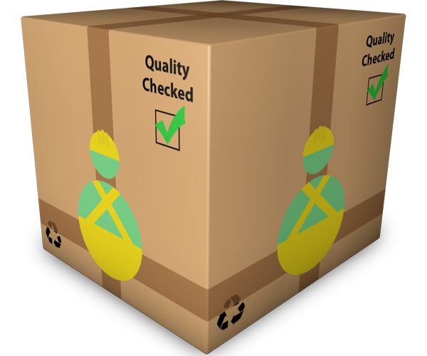

---

  

*Community Bundle* of `Doozr`: The **lightweight** PHP-Framework for **high-performance** websites

| [](https://travis-ci.org/clickalicious/Doozr) 	| [](https://scrutinizer-ci.com/g/clickalicious/Doozr/) 	| [](https://scrutinizer-ci.com/g/clickalicious/Doozr/?branch=master) 	| [](https://www.clickalicious.de/) 	|
|---	|---	|---	|---	|
| [](https://github.com/clickalicious/Doozr/releases) 	|  [](https://packagist.org/packages/clickalicious/doozr)  	| [](http://opensource.org/licenses/BSD-3-Clause) 	| [](https://www.versioneye.com/user/projects/54cf3e45de7924b9e4000483?child=summary)  	|


## Table of Contents

- [Features](#features)
- [Requirements](#requirements)
- [Install](#install)
- [License »](https://github.com/clickalicious/Doozr/blob/master/LICENSE)


## Features

 - Guided Installation
 - Automatic preconfiguring


## Requirements

You will need the following tools to install `Doozr`:

 - `Terminal` (any kind) with the following tools in path:
 
   - `git`
   - `composer`


## Install

The installation of `Doozr` is really easy. Just enter the following commands to install `Doozr` and the `Demo` project:

1. `clone` the project from *github.com* with `git`:
```bash
git clone https://github.com/clickalicious/Doozr-community-bundle.git .
```

2. Install dependencies and call `Doozr's` install routine with `composer`:
```bash
composer install
``` 


## Sponsors

Thanks to our sponsors and supporters:

| JetBrains | Navicat |
|---|---|
| <a href="https://www.jetbrains.com/phpstorm/" title="PHP IDE :: JetBrains PhpStorm" target="_blank"></img></a> | <a href="http://www.navicat.com/" title="Navicat GUI - DB GUI-Admin-Tool for MySQL, MariaDB, SQL Server, SQLite, Oracle & PostgreSQL" target="_blank"></a>  |


###### Copyright
Icons made by <a href="http://www.flaticon.com/authors/sebastian-carl" title="Sebastian Carl">Sebastian Carl</a> licensed by <a href="https://creativecommons.org/licenses/by-nc-nd/4.0/" title="Creative Commons BY NC ND 4.00">CC BY NC ND 4.0</a>
